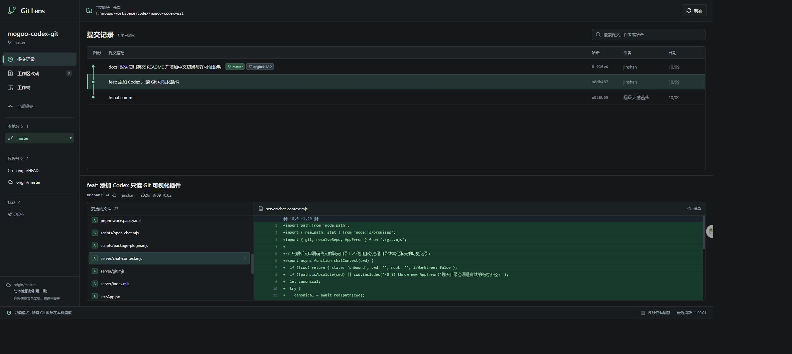

# mogoo-codex-git · Git Lens

**English** | [简体中文](README.zh-CN.md)

A read-only Git panel for Codex. Open the current chat's repository or worktree automatically and explore commits, branches, and file diffs.



## Features

- Commit graph, branch and tag filters, and commit search.
- Commit details and unified file diffs with line numbers.
- Separate staged, unstaged, and untracked changes.
- Worktree overview and optional 15-second auto-refresh.
- Local-only: no repository uploads or Git write operations.

## Install

Requires Codex, Git, Node.js 22.12+, and pnpm 11.9.0. Tested on Windows.

```powershell
git clone https://github.com/MogooStudio/mogoo-codex-git.git
cd mogoo-codex-git
pnpm install
pnpm plugin:build
codex plugin marketplace add .\release\git-lens-0.2.1 --json
codex plugin add git-lens@mogoo-git-lens --json
```

The plugin includes the built UI and service. See the [plugin guide (Chinese)](codex/PLUGIN-README.md) for updates and removal.

## Usage

In your project chat, select **Git Lens** or ask:

> Use Git Lens to open the Git panel for this chat.

The panel opens in Codex's browser with the chat's working directory. Invoke it again after switching chats or worktrees. If the plugin is not visible, open a new chat or restart Codex.

## Development

```powershell
pnpm dev     # Development server
pnpm test    # Integration tests
pnpm build   # Production build
pnpm start   # Serve the production build
```

To get a repository-bound URL, run `pnpm open:chat --cwd <repository-path>`. Set `GIT_LENS_PORT` to override automatic port selection (4317–4326).

## Notes

- Read-only: no staging, commits, branch switching, fetch, or push. Remote status uses local tracking references.
- Search covers loaded commits, up to 2,000. Large diffs and untracked-file previews are capped.
- Bare repositories, blame, image diffs, and arbitrary commit comparisons are not supported. Submodules are not expanded recursively.

## License

[MIT](LICENSE) · Copyright (c) 2026 超级大蘑菇头.
