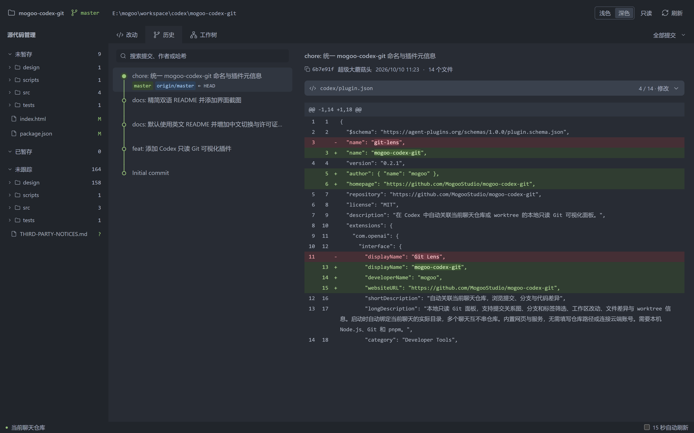

# mogoo-codex-git

**English** | [简体中文](README.zh-CN.md)

A read-only Git panel for Codex. Open the current chat's repository or worktree automatically and explore commits, branches, and file diffs.



## Features

- Commit graph, branch and tag filters, and commit search.
- Commit details and unified file diffs with line numbers.
- Separate staged, unstaged, and untracked changes.
- Worktree overview and optional 15-second auto-refresh.
- Light and dark themes with remembered preference; compact desktop and narrow-panel layouts.
- Local-only: no repository uploads or Git write operations.

## Install

Give this prompt to an agent that can install Codex plugins:

```text
Please install this Codex plugin: https://github.com/MogooStudio/mogoo-codex-git
```

Or run in your terminal:

```powershell
codex plugin marketplace add MogooStudio/mogoo-codex-git --json
codex plugin add mogoo-codex-git@mogoo-codex-git --json
```

Requires Codex with the `codex plugin` commands, Git, and Node.js 22.12+. Tested on Windows. The plugin includes the built UI and service; no manual clone, pnpm, or build is needed for installation. See the [plugin guide (Chinese)](codex/PLUGIN-README.md) for updates, migration, and removal.

## Usage

In your project chat, select **mogoo-codex-git** or ask:

> 用 mogoo-codex-git 打开当前聊天的 Git 面板。

The panel opens in Codex's browser with the chat's working directory. Invoke it again after switching chats or worktrees. If the plugin is not visible, open a new chat or restart Codex.

## Development

Development requires pnpm 11.9.0. Clone the repository and run `pnpm install` first.

```powershell
pnpm dev     # Development server
pnpm test    # Integration tests
pnpm build   # Production build
pnpm start   # Serve the production build
pnpm marketplace:sync  # Build and update the bundled GitHub-installable plugin
pnpm marketplace:check # Check bundled files against the current build
```

To get a repository-bound URL, run `pnpm open:chat --cwd <repository-path>`. Set `GIT_LENS_PORT` to override automatic port selection (4317–4326).

After changing the UI, service, or plugin skill, run `pnpm marketplace:sync` and commit the generated `plugins/mogoo-codex-git/` and `.agents/plugins/marketplace.json` together. Do not edit generated distribution files directly. `pnpm plugin:build` still creates a standalone local distribution.

## Notes

- Read-only: no staging, commits, branch switching, fetch, or push. Remote status uses local tracking references.
- Search covers loaded commits, up to 2,000. Large diffs and untracked-file previews are capped.
- Bare repositories, blame, image diffs, and arbitrary commit comparisons are not supported. Submodules are not expanded recursively.

## License

[MIT](LICENSE) · Copyright (c) 2026 超级大蘑菇头.
